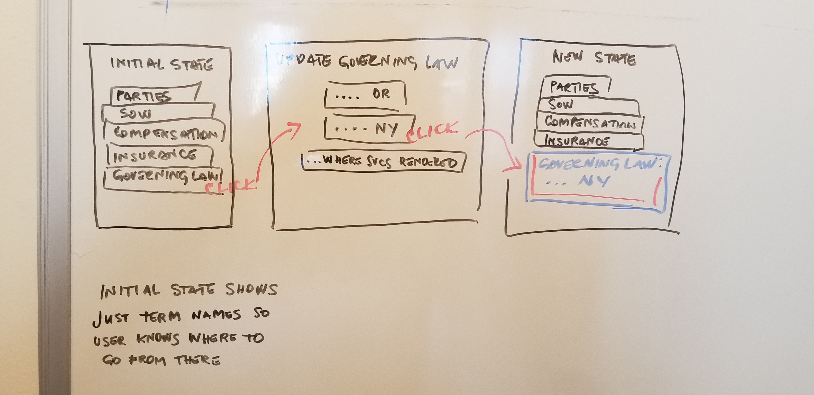

# _APP Name_

This project was bootstrapped with [Create React App](https://github.com/facebook/create-react-app).

#### _React Fundamentals Independent Project_, _24 April 2020_

#### By _**Kristina Hengster Tintor**_

## Description

_Contract Terms & Conditions Management Web App that allows users to generate and modify contracts by selecting appropriate terms and conditions to be used for the type of work being performed or to select appropriate alternative terms & conditions when responding to change requests during negotiations._

## User Stories

* User will see a splash page with Initial State Master Terms List displaying term names
* User can click on a term to edit it:
    - User can choose an alternative term from Alternative Terms List for each specific term (for example, Governing Law term has a list of alternative gov. law terms associated to it)
    - User can also update a term by replacing it with new inputted text
* User can add term to Master Contract Terms List.
  - Input: add Compensation term
  - Output: Compensation term added to Contract Terms List
* User can add new alternative terms to Alternative Terms List for each term
  - Input: Alternative Compensation Terms List = { Existing compensation term }, User adds { alternative compensation term }
  - Output: Alternative Compensation Terms List = { Existing compensation term }, { Alternative compensation term }
* User can view updated/added terms in Contract Terms List
* User can delete term
* After User chooses appropriate terms to show in Master Contract Terms List, User can save the list in the database as a template
* After User chooses appropriate terms to show in Contract Terms List, User can export the Contract Terms List in a formatted Word doc.

## Project Diagram (working version)

## Setup/Installation:

###### For Windows:
_Please visit the [Node.js website](https://nodejs.org/en/download/) for installation instructions._

#### Install this application

_Clone this repository via Terminal using the following commands:_
* _$ cd desktop_
* _$ git clone {url to this repository}_
* _$ cd capstone_
_Then, confirm that you have navigated to the capstone project directory by entering "pwd" in Terminal._

_Next, install npm at the project's root directory via the following commands:_
* _$ npm install_
* _$ npm run build_

_Open the contents of the directory in a text editor or IDE of your choice (e.g., to open the contents of the directory in Visual Studio Code on macOS, enter the command "code ." in Terminal)._

## **Technologies used**

* React 6.13.7

* UUID (for now)

* Git 2.23.0

* Webpack

* JavaScript 

* Visual Studio Code 1.43.1

* GitBash

* Firebase with Firestore

## Available Scripts

In the project directory, you can run:

### `npm start`

Runs the app in the development mode. 
Open [http://localhost:3000](http://localhost:3000) to view it in the browser.

The page will reload if you make edits. 
You will also see any lint errors in the console.

### `npm test`

Launches the test runner in the interactive watch mode. 
See the section about [running tests](https://facebook.github.io/create-react-app/docs/running-tests) for more information.

### `npm run build`

Builds the app for production to the `build` folder. 
It correctly bundles React in production mode and optimizes the build for the best performance.

The build is minified and the filenames include the hashes. 
Your app is ready to be deployed!

See the section about [deployment](https://facebook.github.io/create-react-app/docs/deployment) for more information.

### `npm run eject`

**Note: this is a one-way operation. Once you `eject`, you can’t go back!**

If you aren’t satisfied with the build tool and configuration choices, you can `eject` at any time. This command will remove the single build dependency from your project.

Instead, it will copy all the configuration files and the transitive dependencies (webpack, Babel, ESLint, etc) right into your project so you have full control over them. All of the commands except `eject` will still work, but they will point to the copied scripts so you can tweak them. At this point you’re on your own.

You don’t have to ever use `eject`. The curated feature set is suitable for small and middle deployments, and you shouldn’t feel obligated to use this feature. However we understand that this tool wouldn’t be useful if you couldn’t customize it when you are ready for it.

## Learn More

You can learn more in the [Create React App documentation](https://facebook.github.io/create-react-app/docs/getting-started).

To learn React, check out the [React documentation](https://reactjs.org/).

### Code Splitting

This section has moved here: https://facebook.github.io/create-react-app/docs/code-splitting

### Analyzing the Bundle Size

This section has moved here: https://facebook.github.io/create-react-app/docs/analyzing-the-bundle-size

### Making a Progressive Web App

This section has moved here: https://facebook.github.io/create-react-app/docs/making-a-progressive-web-app

### Advanced Configuration

This section has moved here: https://facebook.github.io/create-react-app/docs/advanced-configuration

### Deployment

This section has moved here: https://facebook.github.io/create-react-app/docs/deployment

### `npm run build` fails to minify

This section has moved here: https://facebook.github.io/create-react-app/docs/troubleshooting#npm-run-build-fails-to-minify

### License

*This webpage is licensed under the MIT license.*

Copyright (c) 2020 **_Kristina Hengster Tintor_**

